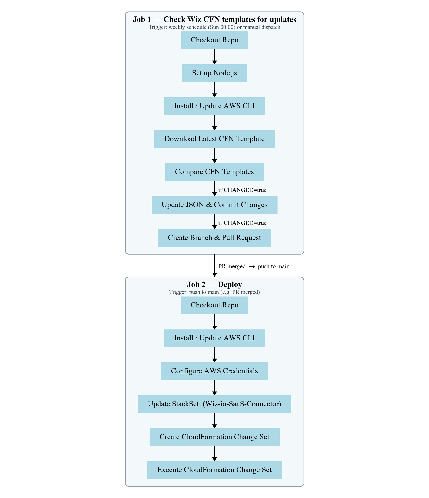
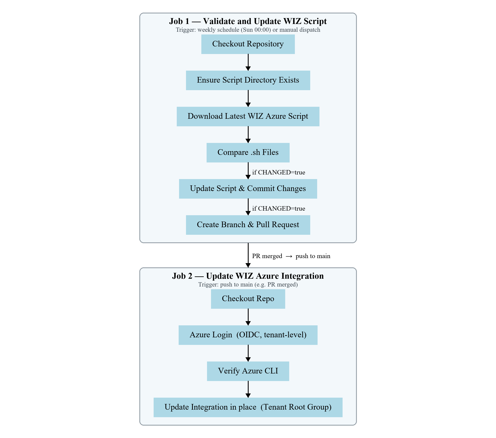

# Wiz Integration Workflows

This repository contains the GitHub Actions workflows that keep the Wiz cloud integration up to date. Two workflows are included:

- **CloudFormation (CFN) Workflow** — keeps the AWS CloudFormation StackSet and template current, then deploys the changes.
- **Azure Integration Workflow** — keeps the Wiz Azure script current and re-applies it to the live Azure integration.

Each workflow automatically checks for upstream updates from Wiz, opens a pull request when a change is detected, and deploys/applies the change once it is merged to `main`.

## CloudFormation (CFN) Workflow

This workflow ensures the latest CloudFormation template is updated, verified, and deployed. It consists of the following key steps:

### 1. **Template Verification**
   - **Checkout Repo**: Checks out the repository to the GitHub Actions runner.
   - **Set Up Node.js**: Sets up Node.js for any required scripting.
   - **Download Latest CFN Template**: Fetches the latest CloudFormation template from an S3 bucket.
   - **Compare CFN Templates**: Compares the downloaded template with the existing template in the repository.
   - **Update JSON and Commit Changes**: If changes are detected, updates the existing template, commits the changes, and pushes them to a new branch.
   - **Create Pull Request**: Creates a pull request for review, notifying the assigned reviewers.

### 2. **Deployment**
After a template change is merged to the `main` branch, the deploy job is triggered:
   - **Install/Update AWS CLI**: Ensures the latest AWS CLI is available on the runner.
   - **Configure AWS Credentials**: Configures AWS credentials using the specified role.
   - **Update StackSet**: Updates the `Wiz-io-SaaS-Connector` AWS CloudFormation StackSet.
   - **Create Change Set**: Creates a change set for the StackSet.
   - **Execute Change Set**: Executes the created change set.

### Workflow Diagram

The diagram below provides a visual representation of the workflow:



### How It Works

1. **Trigger Conditions**:
   - The workflow is triggered by a push to the `main` branch or by a weekly schedule (cron).
   - On detecting changes in the `CFN_Template/` directory, the workflow validates and updates the CloudFormation template.

2. **Template Comparison**:
   - Downloads the latest template.
   - Normalizes both templates for comparison.
   - If changes are detected, commits and creates a pull request.

3. **Deployment**:
   - On merging the pull request to `main`, the deploy job updates and executes the CloudFormation StackSet change set.

## Azure Integration Workflow

In addition to the CloudFormation workflow, a separate GitHub Actions workflow ([`azure-connector.yaml`](./.github/workflows/azure-connector.yaml)) keeps the Wiz Azure script (`scripts/wiz-azure.sh`) current **and** re-applies it to the live Azure integration. When Wiz publishes a new version of the script (e.g. adding new permissions or capabilities), this workflow updates the file and then reconciles the existing Azure integration so roles, permissions, and the app registration stay current.

It runs as two jobs:

### 1. **Validate and Update WIZ Script**
Runs on the weekly schedule or a manual dispatch:
   - **Checkout Repository**: Checks out the repository to the GitHub Actions runner.
   - **Ensure Script Directory Exists**: Creates the `scripts/` directory if it does not already exist.
   - **Download Latest WIZ Azure Script**: Fetches the latest `wiz-azure.sh` from the Wiz downloads endpoint.
   - **Compare .sh Files**: Compares the downloaded script with the version stored in the repository.
   - **Update Script and Commit Changes**: If changes are detected, overwrites the existing script, commits the change, and stages it on a new branch.
   - **Create Pull Request**: Opens a pull request (`update-wiz-azure-script`) for review, notifying the assigned reviewers.

### 2. **Update WIZ Azure Integration**
Runs after the pull request is merged to `main` (a push event):
   - **Checkout Repo**: Checks out the repository to the runner.
   - **Azure Login**: Authenticates to Azure with keyless OIDC at the tenant level (`azure/login@v2`, `allow-no-subscriptions: true`).
   - **Verify Azure CLI**: Confirms the Azure CLI is available (`az version`).
   - **Update Integration (in place)**: Re-runs the latest script against the **Tenant Root Group** management group:
     ```
     wiz-azure.sh --quiet standard management-group-deployment <tenant-id>
     ```
     The script uses create-or-update semantics, so this reconciles the existing `WizCustomRole`, the `Wiz Security` app registration, and the role assignments to the current specification rather than performing a fresh onboarding.

### Why the Tenant Root Group?

Deploying at the **Tenant Root Group** management group (whose management-group ID is the tenant ID) covers the entire organization in one shot. Per the Wiz documentation, once the Tenant Root Group is connected, any Management Groups and/or Subscriptions added in the future are automatically detected and scanned — so coverage includes subscriptions that don't exist yet.

### Trigger Conditions

   - A push to the `main` branch that touches the `scripts/` directory (runs the update-integration job).
   - A weekly schedule (cron, Sunday at midnight) and manual `workflow_dispatch` (run the check-for-updates job).

### Workflow Diagram



## Repository Structure

- **`CFN_Template/`**: Contains the CloudFormation templates.
- **`scripts/`**: Contains the Wiz Azure script (`wiz-azure.sh`).
- **`WIZ_CFN_Workflow_Full.png`**: Visual representation of the CloudFormation workflow.
- **`WIZ_Azure_Workflow.png`**: Visual representation of the Azure integration workflow.
- **`.github/workflows/`**: Directory containing the GitHub Actions workflow YAML files.

## Prerequisites

**CloudFormation workflow**
- AWS roles and permissions configured for the deployment.
- Secrets for `AWS_ROLE` and `GH_TOKEN` added to the repository settings.

**Azure integration workflow**
- Secrets for `AZURE_CLIENT_ID` and `AZURE_TENANT_ID` added to the repository settings (the deploy job uses OIDC, so no client secret or subscription ID is stored).
- A federated (OIDC) credential on the `AZURE_CLIENT_ID` app trusting this repository's `main` branch.
- The service principal must have, at the Tenant Root Group scope, **Owner** or **User Access Administrator** (to manage the custom role and role assignments) plus **Application Administrator** in Entra ID (to manage the app registration).

## Contributing

To contribute:
1. Fork this repository.
2. Create a feature branch.
3. Submit a pull request with your changes.

## License

This project is licensed under the MIT License. See the `LICENSE` file for details.
